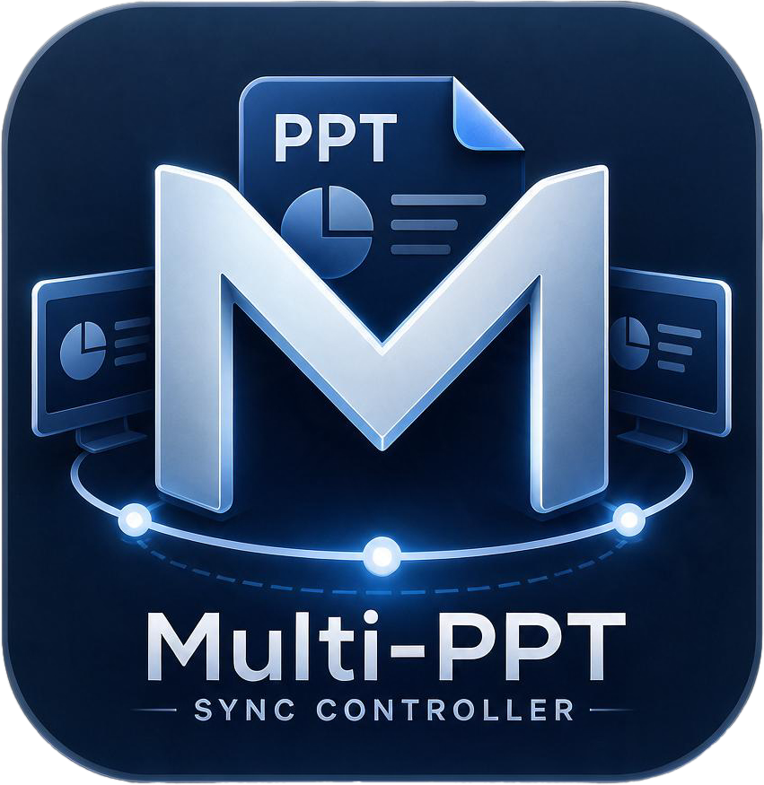

# MultiPPT 多屏同步放映

> **一块控制台，多块屏幕，一份节奏。**  
> 把每一份 PPT、每一份 PDF，送到它该在的屏幕——一键开播，翻页齐步走。

做给 **展厅、汇报厅、多屏舞台** 的桌面放映指挥台：同一台电脑接入多台显示器，每台显示器要播放不同的PPT,还要求PPT要实时同步（如：中文、外文多语言PPT,需要同时播放）本项目是专为这种特殊场景准备的播放工具。
一台电脑导入多份文稿，指定各屏播哪一份；开播后操作员只按一次「下一步」，全场齐步。不是再做一个普通播放器，而是把「多屏各播各的」变成「一人指挥、全场同步」。

- **分得清：** 主屏讲故事，副屏放数据，稿件互不抢屏。  
- **控得住：** 导入、绑屏、开播，三步上台。  
- **跟得上：** 单击动画先播再翻页，主副屏不各走各的。  
- **接得住：** PPTX / PPT / WPS 稿 / PDF，同一控制台编排。

<p align="center">
  
</p>

## 功能一览

| 能力 | 说明 |
| --- | --- |
| 多文件导入 | 支持 `.pptx / .ppt / .pptm / .dps / .dpt / .pdf`，可拖放 |
| 分屏绑定 | 一份文稿可绑多块屏；同一块屏只能给一份文稿 |
| PPTX 放映 | **主屏** WebView2 + `pptx-vanilla-viewer`；**副屏** WPS 真 Slide Show |
| PDF 放映 | 主屏、副屏都走 WebView2 + pdf.js，可主屏 PDF + 副屏 PPTX 混播 |
| 同步翻页 | 方向键 / 空格 / 主屏播放条：各屏各走一步；PPT 有单击则先播动画再翻页 |
| 结束放映 | `Esc` 结束，控制台回到前台 |

## 界面截图

### 启动控制台

导入前的空片库与屏幕编排。默认窗口 **1040×680**，可放大。


### 导入文稿并指定屏幕

左侧片库列出已导入文件，下拉多选输出屏幕；右侧预览当前扩展桌面。点「开始放映」后控制台收起，画面铺到对应显示器。


## 使用说明

### 环境要求

- Windows 10/11，显示器建议设为 **扩展** 模式（不是复制）
- [.NET 8 Desktop Runtime](https://dotnet.microsoft.com/download/dotnet/8.0)（从源码编译还需 SDK）
- 副屏播放 **PPTX** 需安装 **WPS 演示**（本机需能创建 `KWPP.Application`）
- 主屏 Web 播放需 **WebView2**（Win11 一般已自带）
- 仅播 PDF、或只在主屏播 PPTX 时，可以没有 WPS

### 编译运行

```powershell
cd D:\workstation\MultiPPTController
dotnet build MultiPPTController.sln -c Debug
Start-Process src\MultiPPTController\bin\Debug\net8.0-windows\MultiPPTController.exe
```

首次改主屏播放器前端时，先构建 PlayerHost：

```powershell
cd tools\player-host
npm install
npm run build
```

仓库已包含 `PlayerHost/vendor/player.js`，日常编译不必每次跑 npm。

### 操作步骤

1. **导入**：点「导入 PPT / PDF」，或把文件拖进左侧片库。
2. **分屏**：在每份文稿的下拉框里勾选屏幕。灰色项表示已被其他文稿占用。
3. **开播**：至少一份文稿已指定屏幕后，「开始放映」可点。控制台会隐藏。
4. **翻页**：
   - 方向键、空格：各屏同步下一步 / 上一步
   - 主屏播放条上一页 / 下一页：同样同步副屏
   - 主屏画面单击：PPT 走单击动画，PDF 翻下一页
5. **结束**：按 `Esc`，或开播前在控制台点「结束」。

仓库自带小样：`testdata/deck1.pptx`、`testdata/deck2.pptx`、`testdata/sample.pdf`。

### 播放引擎怎么选

| 文件 | 主屏 | 副屏 |
| --- | --- | --- |
| PPTX / PPT | Web 播放器 | WPS 真 Slide Show |
| PDF | Web + pdf.js | Web + pdf.js |

可以混用，例如 **主屏 PDF + 副屏 PPTX**。混播时两边各走一步；PDF 一步就是翻页，PPT 有单击动画时页码不一定始终相同。

体积很大、嵌了大量字体的 PPTX（例如一百多 MB）在主屏 Web 里可能长时间停在 loading，这类文稿请放到副屏用 WPS，或另存精简版再上主屏。

## 项目结构

```
MultiPPTController/
├── src/MultiPPTController/   # WPF 控制台、编排器、Web/WPS 放映
├── PlayerHost/               # 主屏/PDF 播放页（随工程复制到输出目录）
├── tools/player-host/        # 播放器源码（pptx-vanilla-viewer + pdf.js）
├── testdata/                 # 冒烟用小样
├── docs/screenshots/         # README 截图
└── 说明文档.md               # 规划、方案与进度
```

## 许可

本项目以 [MIT License](LICENSE) 开源。

第三方组件：`pptx-vanilla-viewer`（Apache-2.0）、`pdf.js`（Apache-2.0）。
